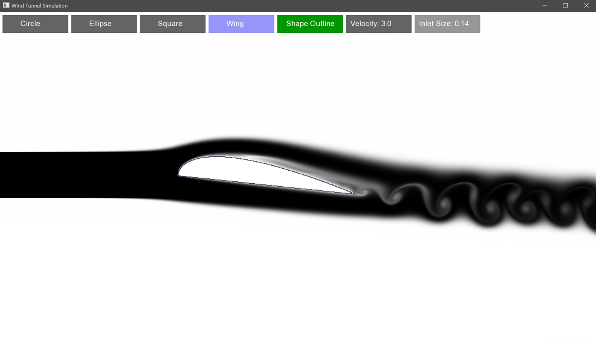

# WindTunnelSim

WindTunnelSim is a C++ simulation tool. It models a fluid within a 2D wind tunnel environemnt, around an object of the user's choice. Utilising the Cuda GPU acceleration libary, it provides a high frame rate, high resolution image.

## Features

- **GPU acceleraion**: Utilising the **Cuda** libary to optimise simulation, through parallel proccessing.
- **Customisability**: Allows the user to choose the object in the tunnel, as well as wind speed and smoke inlet size.
- **Realistic fluid flow**: Using methods such as semi-lagrangian advection, and iterative gauss-siedel, it provides a realistic simulation for fluids that are incompressable, and non-viscous.

## Comparsion the real world

| Simulation | Aerofoil Template |
|-----------|-----------------|
|  |  |

## Example of the application

## Prerequisites

- **Cuda compatible Nvidia GPU**: Ensure you have a compatible GPU, before downloading. You can check it here: [official Nvidia website](https://developer.nvidia.com/cuda-gpus).

## Running the Application

To execute the simulation execution file, download the Wind Tunnel simulation zip file from the latest release [releases section](https://github.com/jwdlb/WindTunnelSimulation/releases).
Then unZip in the desired foler, and double click on the executable to run.

## Impovements
Further improvements to be made include:
- Movable objects
- Custom Objects
- 3D simulation

